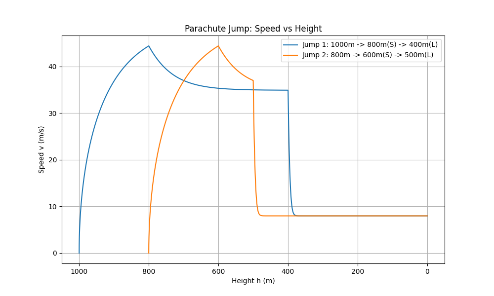
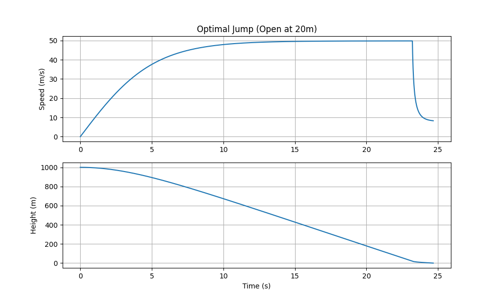
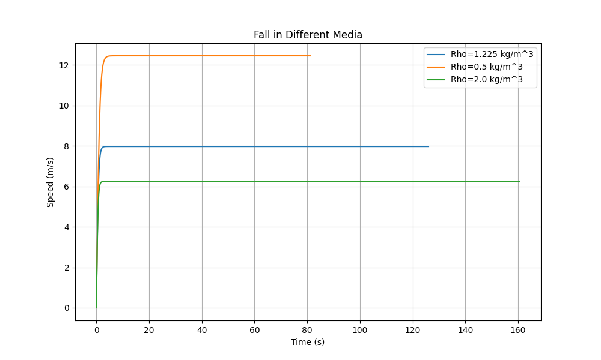

# Движение тела с учетом сопротивления среды (№4.7)

## Описание
Реализовано дискретное моделирование падения парашютиста. Решение написано на языке программирования Python.

## Теоретическая модель
Движение описывается системой дифференциальных уравнений:
$\frac{dy}{dt} = -v$
$m \frac{dv}{dt} = mg - F_{c}$

Сила сопротивления воздуха:
$F_{c} = k_1 v + k_2 v^2$

Где:
* $y$: Высота (м)
* $v$: Скорость вниз (м/с)
* $m$: Масса тела (кг)
* $g$: Ускорение свободного падения ($9.81 м/с^2$)
* $k_1$: Линейный коэффициент сопротивления ($k_1 = 6\pi\mu r$ для шарообразного тела)
* $k_2$: Квадратичный коэффициент сопротивления ($k_2 = 0.5 C_x \rho S$)
* $\rho$: Плотность воздуха ($1.225 кг/м^3$)
* $C_x$: Коэффициент лобового сопротивления
* $S$: Площадь поперечного сечения ($м^2$)
* $\mu$: Динамическая вязкость воздуха (0.0182 Н·с/м² при 20°C)

## Дискретная модель
Используется метод Эйлера с шагом по времени $\Delta t$:
$t_{i+1} = t_i + \Delta t$
$v_{i+1} = v_i + \left( g - \frac{k_1(y_i)}{m} v_i - \frac{k_2(y_i)}{m} v_i^2 \right) \Delta t$
$y_{i+1} = y_i - v_i \Delta t$

Коэффициенты $k_1(y_i)$ и $k_2(y_i)$ изменяются в зависимости от высоты и состояния системы (свободное падение, малый парашют, большой парашют).

## Алгоритм
1.  **Инициализация**: Задаются начальная высота $H_0$, скорость $V_0=0$, время $T_0=0$. Определяются параметры системы.
2.  **Цикл моделирования** (пока $y > 0$):

    a.  **Определение состояния**: Вычисляются текущие $S$ и $C_x$ на основе высоты $y$.

    b.  **Расчет коэффициентов $k_1$ и $k_2$**.

    c.  **Обновление скорости**: $v_{new} = v + (g - \frac{k}{m} v^2) \Delta t$.
    
    d.  **Обновление координат**: $y_{new} = y - v \Delta t$.
    
    e.  **Обновление времени**: $t = t + \Delta t$.
3.  **Вывод**: Сохранение данных и построение графиков.

## Результаты моделирования

### 1. Зависимость скорости от высоты
На графике ниже представлены два сценария прыжка (аналогично рис. 4.12 из задания):
1.  Прыжок с 1000 м: раскрытие малого парашюта на 800 м, большого — на 400 м.
2.  Прыжок с 800 м: раскрытие малого парашюта на 600 м, большого — на 500 м.



Видно, что при раскрытии парашюта скорость резко падает до нового значения установившейся скорости (terminal velocity). В обоих случаях конечная скорость составляет около 8 м/с, что меньше безопасного порога 10 м/с.

### 2. Безопасная высота раскрытия
Был проведен эксперимент по поиску минимальной высоты, на которой необходимо открыть основной парашют для безопасного приземления ($v \le 10$м/с).
**Результат**: Минимальная высота составляет **20 метров**.



### 3. Влияние плотности среды
Рассмотрено падение в средах с различной плотностью. В более плотной среде сопротивление выше, что приводит к меньшей скорости падения.



### 4. Связь высоты и площади
Для обеспечения безопасной скорости приземления (10 м/с) в установившемся режиме необходима площадь парашюта не менее **9.61 м²** (для массы 90 кг).

## Исходный код программы

Файл: `main.py`

```python
import numpy as np
import matplotlib.pyplot as plt

M = 90.0
G = 9.81
RHO = 1.225
CX_BODY = 1.0
CX_PARA = 1.5
DT = 0.01
MU_AIR = 0.0182
R_BODY = 0.4

K1_BODY = 6 * np.pi * MU_AIR * R_BODY

def calculate_area(target_v, cx):
    k = M * G / (target_v ** 2)
    s = k / (0.5 * cx * RHO)
    return s


S_BODY = calculate_area(50.0, CX_BODY)
S_SMALL = calculate_area(35.0, CX_PARA)
S_LARGE = calculate_area(8.0, CX_PARA)

R_SMALL = np.sqrt(S_SMALL / np.pi)
R_LARGE = np.sqrt(S_LARGE / np.pi)
K1_SMALL = 6 * np.pi * MU_AIR * R_SMALL
K1_LARGE = 6 * np.pi * MU_AIR * R_LARGE

print(f"Calculated Areas: Body={S_BODY:.2f}, Small={S_SMALL:.2f}, Large={S_LARGE:.2f}")
print(f"Linear coefficients: k1_body={K1_BODY:.4f}, k1_small={K1_SMALL:.4f}, k1_large={K1_LARGE:.4f}")

def get_coefficients(current_h, triggers):
    current_k1 = K1_BODY

    sorted_triggers = sorted(triggers, key=lambda x: x[0])

    for h_trig, s_val, cx_val in sorted_triggers:
        if current_h < h_trig:
            if abs(s_val - S_SMALL) < 0.01:
                current_k1 = K1_SMALL
            elif abs(s_val - S_LARGE) < 0.01:
                current_k1 = K1_LARGE
            else:
                current_k1 = K1_BODY

            k2 = 0.5 * cx_val * RHO * s_val
            return current_k1, k2

    k2 = 0.5 * CX_BODY * RHO * S_BODY
    return current_k1, k2


def simulate_jump(h0, triggers, max_t=300):
    t_values = [0.0]
    h_values = [h0]
    v_values = [0.0]

    h = h0
    v = 0.0
    t = 0.0

    while h > 0 and t < max_t:
        k1, k2 = get_coefficients(h, triggers)

        dv = G - (k1 * v + k2 * v ** 2) / M

        v_new = v + dv * DT
        h_new = h - v * DT

        t += DT

        t_values.append(t)
        h_values.append(h_new)
        v_values.append(v_new)

        h = h_new
        v = v_new

    return np.array(t_values), np.array(h_values), np.array(v_values)


def run_scenarios():
    global RHO

    triggers1 = [
        (800, S_SMALL, CX_PARA),
        (400, S_LARGE, CX_PARA)
    ]

    triggers2 = [
        (600, S_SMALL, CX_PARA),
        (500, S_LARGE, CX_PARA)
    ]

    t1, h1, v1 = simulate_jump(1000, triggers1)

    print(f"With k1: landing speed = {v1[-1]:.2f} m/s")

    t2, h2, v2 = simulate_jump(800, triggers2)

    plt.figure(figsize=(10, 6))
    plt.plot(h1, v1, label='Jump 1: 1000m -> 800m(S) -> 400m(L)')
    plt.plot(h2, v2, label='Jump 2: 800m -> 600m(S) -> 500m(L)')
    plt.gca().invert_xaxis()
    plt.xlabel('Height h (m)')
    plt.ylabel('Speed v (m/s)')
    plt.title('Parachute Jump: Speed vs Height')
    plt.grid(True)
    plt.legend()
    plt.savefig('velocity_vs_height.png')
    print("\nGenerated velocity_vs_height.png")

    print("\n--- Experiment 1: Safe opening height (with k1) ---")
    safe_v = 10.0
    found_h = None

    for h_open in range(0, 1000, 10):
        trigs = [(h_open, S_LARGE, CX_PARA)]
        t, h, v = simulate_jump(1000, trigs)
        v_land = v[-1]
        if v_land <= safe_v:
            found_h = h_open
            print(f"Opening at {h_open}m gives landing speed {v_land:.2f} m/s (Safe)")
            break

    if found_h is None:
        print("Could not find safe height")
    else:
        print(f"Minimum safe opening height: {found_h} m")

        trigs = [(found_h, S_LARGE, CX_PARA)]
        t, h, v = simulate_jump(1000, trigs)

        plt.figure(figsize=(10, 6))
        plt.subplot(2, 1, 1)
        plt.plot(t, v)
        plt.ylabel('Speed (m/s)')
        plt.title(f'Optimal Jump (Open at {found_h}m)')
        plt.grid(True)

        plt.subplot(2, 1, 2)
        plt.plot(t, h)
        plt.ylabel('Height (m)')
        plt.xlabel('Time (s)')
        plt.grid(True)
        plt.savefig('safe_jump_profile.png')
        print("Generated safe_jump_profile.png")

    print("\n--- Experiment 3: Different Densities ---")
    densities = [1.225, 0.5, 2.0]
    plt.figure(figsize=(10, 6))

    original_rho = RHO

    for rho_val in densities:
        RHO = rho_val

        trigs = [(1000, S_LARGE, CX_PARA)]
        t, h, v = simulate_jump(1000, trigs)
        plt.plot(t, v, label=f'Rho={rho_val} kg/m^3')

    RHO = original_rho
    plt.xlabel('Time (s)')
    plt.ylabel('Speed (m/s)')
    plt.title('Fall in Different Media')
    plt.legend()
    plt.grid(True)
    plt.savefig('density_comparison.png')
    print("Generated density_comparison.png")

if __name__ == "__main__":
    run_scenarios()
```
